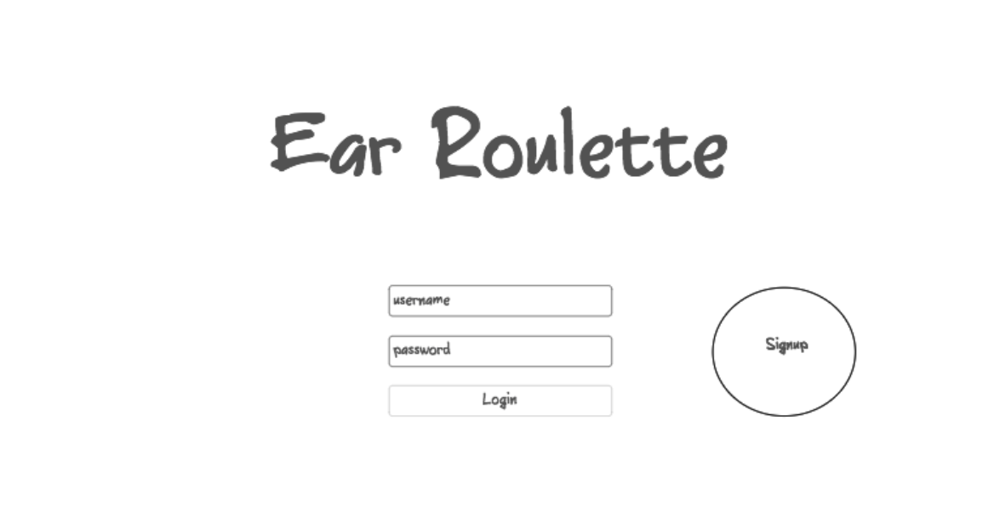
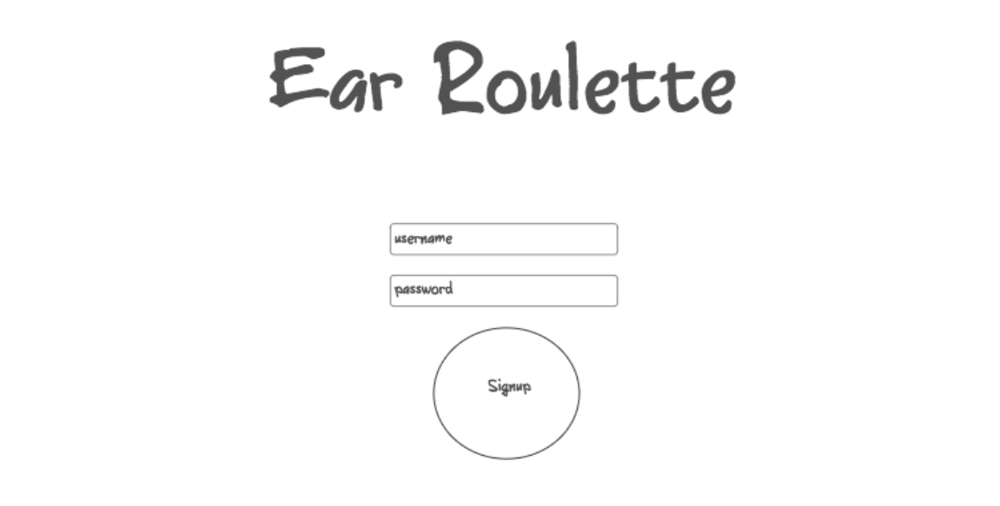
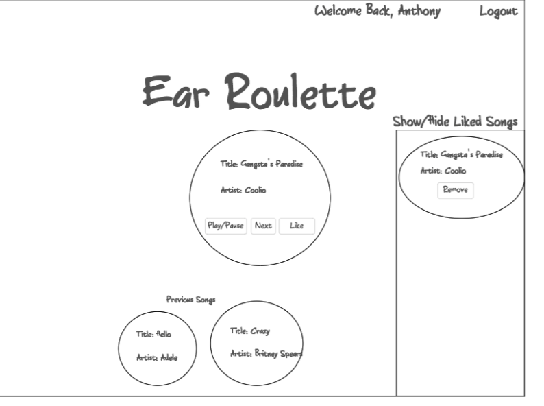

## Ear Roulette

### Description
Ear Roulette is a jukebox for people with short attention spans. All of the tracks in the jukebox last for 30 seconds before the next one is played. You will never be bored of music again.

### User Stories
  * User will be able to listen to 30 second previews of songs
  * User will not have to click any buttons to go to the next songs; it will automatically do so
  * User will be able to pause the song, but won't be able to change songs
  * User will be to save the **name** and **artist** of the song they like into a list, so that they're able to search for the song later on
  * User will be able to sign up and log in to an account
  * User will be able to view all of their saved songs
  * User will be able to delete their saved songs

## Wireframes

## Technologies Used
This application will be built using the MEAN stack. It will use the Spotify API to get all of the music track information.
